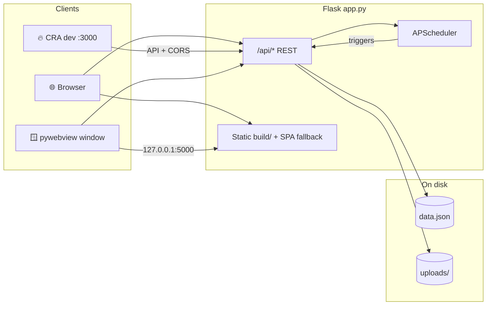
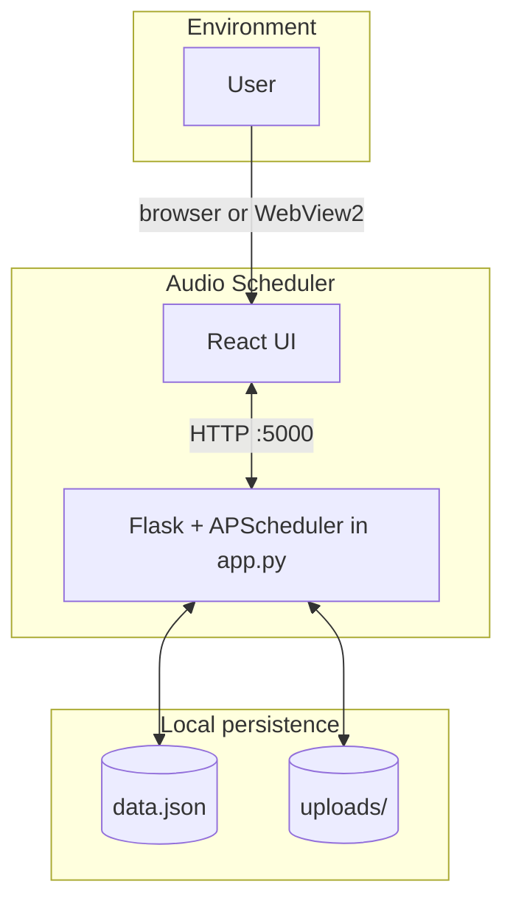
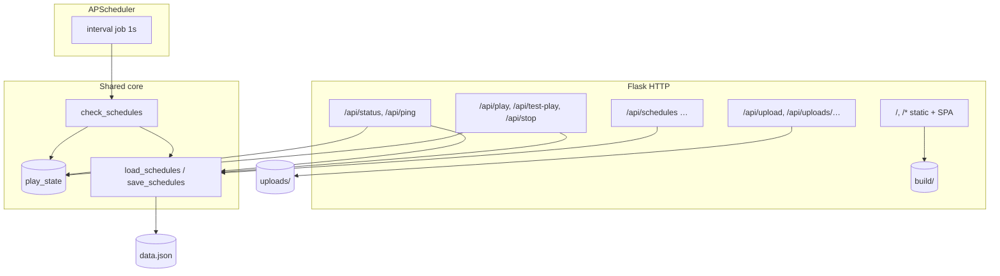
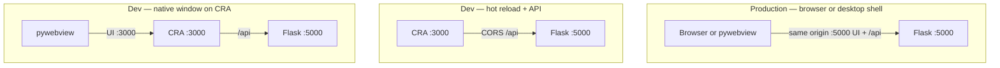
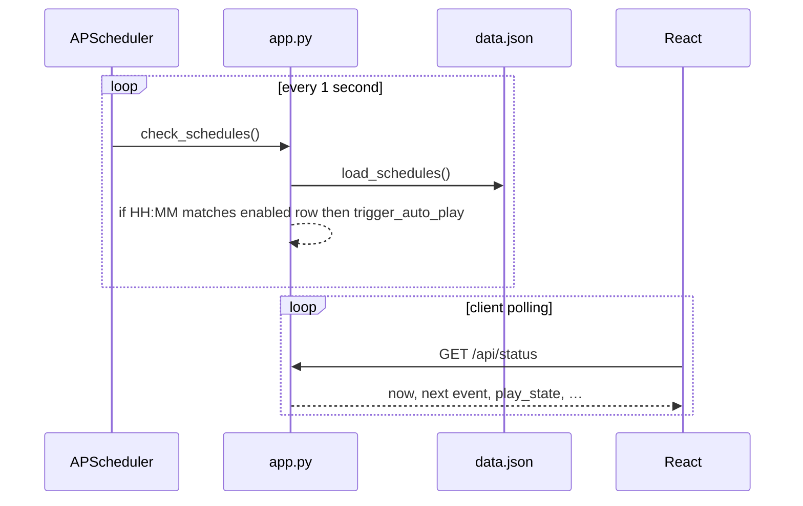
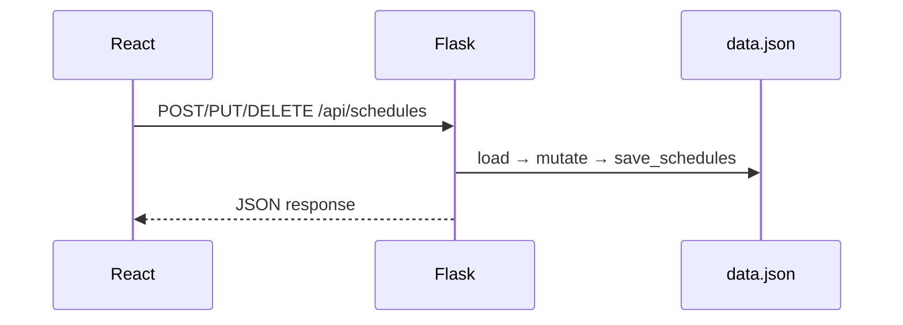
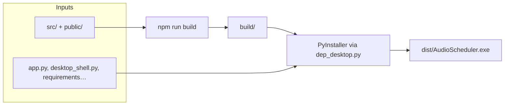

# 🎧 Audio Scheduler — Web & Desktop

A Sinhala-friendly **audio scheduler**: schedule playback at set times, upload audio, and see the current time and next event. The UI is **React (CRA)**; the API and static `build/` folder are served by **Flask** on port **5000**. A **native Windows window** uses **pywebview** (`desktop_shell.py`) to show the same app.

---

## 📌 At a glance — topics

| Area | What this project uses |
|------|------------------------|
| **UI / frontend** | React, Create React App, Sinhala strings (`src/uiStrings.js`) |
| **API & static hosting** | Flask, Flask-CORS, serves `build/` and `/api/*` |
| **Scheduling** | APScheduler (background jobs for timed playback) |
| **Desktop** | pywebview, Microsoft Edge WebView2, optional PyInstaller one-file `.exe` |
| **Data** | `data.json` (schedules), `uploads/` (audio files) — next to app or next to `.exe` |
| **Build / ship** | `npm run build`, `dep_desktop.py` → `dist/AudioScheduler.exe` |

**Keywords:** *audio scheduling, timed playback, Sinhala localization, Flask REST API, React SPA, WebView2 desktop shell, Windows portable app.*

---

## 🏗️ Project architecture

High-level flow: the **React** client talks to **Flask** on port 5000; the **scheduler** runs in the same Python process; **desktop** is a thin host that embeds the same UI.



**Responsibilities**

- **`app.py`** — HTTP API, static `build/`, job scheduling, playback coordination, `data.json` and `uploads/`.
- **`src/` (React)** — UI, status polling, schedule CRUD, uploads; calls `http://localhost:5000/api` (see `App.js`).
- **`desktop_shell.py`** — Ensures Flask is up, opens a WebView2 window to `http://127.0.0.1:5000` (or `--dev` → port 3000 for hot reload when CRA is running).
- **`dep_desktop.py` / `dep.py`** — Package Python + assets into **PyInstaller** executables.

### System context (actors & data stores)



### Component view — `app.py` (routes vs scheduler vs state)

`check_schedules` runs on an **APScheduler** interval of **1 second**; it reads `data.json` and may call `trigger_auto_play` when the clock matches an enabled schedule.



### Runtime deployment (three ways to run the UI)



- **m1** — `npm run build` + `app.py` or `desktop_shell.py` (no `--dev`). UI is always from **`build/`** on port 5000.
- **m2** — `npm start` + `app.py`: browser on **3000**, API on **5000**.
- **m3** — `npm start` + `desktop_shell.py --dev`: window loads **3000**; API still on **5000** (CORS on React origin).

### Sequence — automatic play at scheduled time



### Sequence — create or update a schedule



### Build and packaging (Windows `.exe`)



*View this file in a Mermaid-capable preview (e.g. GitHub, many IDEs) to see the diagrams rendered.*

---

## ✨ Features

- ⏰ Schedule audio playback at specific times (with enable/disable per schedule)
- 📤 Upload and manage audio files (stored under `uploads/`)
- 🔄 Background scheduling via **APScheduler**
- 📊 Status polling: current time, next event, countdown, playback state
- **සිංහල** **Sinhala** UI strings (see `src/uiStrings.js`)

---

## 🧰 Prerequisites

| Tool | Notes |
|------|--------|
| **Node.js** (LTS) | For `npm install`, `npm run build`, `npm start` |
| **Python 3** | `py -3` on Windows; use `python3` / `python` on other OSes where applicable |
| **Microsoft Edge WebView2** | Required for the **desktop window** and for **`AudioScheduler.exe`**. [Download WebView2 Runtime](https://developer.microsoft.com/microsoft-edge/webview2/) if the window is blank. |

---

## 📁 Repository layout

Everything important lives in the **project root** (same folder as `package.json` and `app.py`).

```
.
├── app.py                 # Flask app: REST API + serves React from build/
├── desktop_shell.py       # Native window: starts Flask on 127.0.0.1:5000 + pywebview
├── dep_desktop.py         # Builds dist/AudioScheduler.exe (npm build + PyInstaller)
├── dep.py                 # Optional: PyInstaller recipe for Flask-only app.py (no webview)
├── package.json
├── requirements.txt       # Runtime Python deps (Flask, CORS, APScheduler, pywebview, …)
├── requirements-build.txt # PyInstaller (only needed to build .exe)
├── src/                   # React source (App.js, uiStrings.js, …)
├── public/
├── build/                 # Created by `npm run build` — Flask static files
├── data.json              # Created at runtime — schedule data (next to app or .exe)
├── uploads/               # Created at runtime — uploaded audio
├── run-desktop.bat        # npm run build, then desktop_shell.py
├── build-desktop-exe.bat  # npm run build + dep_desktop.py → dist/AudioScheduler.exe
└── dist/                  # After build: AudioScheduler.exe
```

---

## ⚙️ One-time setup

From the project root:

```bash
# Python dependencies (Flask API + desktop shell)
py -3 -m pip install -r requirements.txt

# JavaScript dependencies
npm install
```

---

## 🌐 Run in the browser (Flask only)

1. **Production UI** — build the React app, then start Flask:

   ```bash
   npm run build
   py -3 app.py
   ```

2. Open **http://localhost:5000/** (a browser tab may open automatically).

`app.py` serves the **`build/`** folder and exposes the API under **`/api/*`**.  
`data.json` and **`uploads/`** are created in the **current working directory** (the project root when you run from there).

---

## 🔥 Run with live React dev server (two terminals)

The frontend calls **`http://localhost:5000/api`** directly (`src/App.js`), so Flask must be running with CORS (already enabled in `app.py`).

1. **Terminal A** — API + static build is **not** required for hot reload of JS; you only need Flask. You can still run a previous `npm run build` or run Flask alone:

   ```bash
   py -3 app.py
   ```

   If you have not run `npm run build` yet, create an empty `build/index.html` or run `npm run build` once so Flask’s static folder is valid.

2. **Terminal B** — CRA dev server:

   ```bash
   npm start
   ```

3. Open **http://localhost:3000** in the browser for hot reload. API traffic goes to port **5000**.

---

## 🖥️ Desktop app (native window, pywebview)

Flask always listens on **`http://127.0.0.1:5000`**. The window loads either the **built** UI from Flask or the **CRA dev** server.

| Mode | UI source | Command |
|------|-----------|---------|
| **Production** | `build/` served by Flask on port 5000 | After `npm run build`: `py -3 desktop_shell.py` |
| **Convenience** | Rebuild + open window | `npm run desktop` or double-click **`run-desktop.bat`** |
| **Development** | **http://127.0.0.1:3000** (hot reload) | Terminal 1: `npm start` — Terminal 2: `py -3 desktop_shell.py --dev` |

**`--dev`**: start **`npm start` first**; the shell waits until port 3000 responds, then opens the window. Flask still serves **`/api`** on 5000.

Window title (Sinhala) is set in `desktop_shell.py`.

---

## 📦 Build `AudioScheduler.exe` (Windows)

Single **one-file** executable: **`dist/AudioScheduler.exe`** (no console window).

1. Install build tools (once):

   ```bash
   py -3 -m pip install -r requirements.txt -r requirements-build.txt
   ```

2. From the project root:

   ```bash
   py -3 dep_desktop.py
   ```

   Or double-click **`build-desktop-exe.bat`**.

This runs **`npm run build`**, then **PyInstaller** via `python -m PyInstaller` (so the `pyinstaller` executable does not need to be on `PATH`). Optional icon: place **`myicon.ico`** in the project root; it is picked up automatically if present.

**After shipping the .exe**

- **`data.json`** and **`uploads/`** are created **next to** `AudioScheduler.exe` (portable data).
- Install **WebView2 Runtime** on target PCs if the window does not appear.
- If PyInstaller omits webview assets on some machines, add `--collect-all webview` to the PyInstaller command in `dep_desktop.py` and rebuild.

---

## 🔌 HTTP API (summary)

Base URL: **`http://localhost:5000`** (or `127.0.0.1`).

| Method | Path | Purpose |
|--------|------|---------|
| GET | `/api/ping` | Health check (used by `desktop_shell` before opening the window) |
| GET/POST | `/api/schedules` | List / create schedules |
| PUT/DELETE | `/api/schedules/<id>` | Update / delete |
| POST | `/api/upload-audio` | Upload audio file |
| GET | `/api/uploads/<filename>` | Serve upload |
| POST | `/api/play/<schedule_id>` | Trigger scheduled play |
| POST | `/api/test-play` | Test playback body |
| POST | `/api/stop` | Stop playback |
| GET | `/api/status` | Current time, next event, playback state |
| GET | `/exit` | Request app shutdown (used from UI) |

Static SPA routes fall through to `index.html` for client-side routing.

---

## 🧩 Optional: Flask-only `.exe` (no native window)

`dep.py` builds a standalone **`app.py`** executable (browser use case). It expects **`myicon.ico`** and calls **`pyinstaller`** directly; you may need to change it to `py -3 -m PyInstaller` (same idea as `dep_desktop.py`) or ensure `pyinstaller` is on `PATH`. Run **`npm run build`** first so `build/` exists.

---

## 📜 Scripts reference (`package.json`)

| Script | Action |
|--------|--------|
| `npm start` | CRA dev server (port 3000) |
| `npm run build` | Production build → `build/` |
| `npm run desktop` | `npm run build` then `py -3 desktop_shell.py` |
| `npm test` | React tests |

---

## 🩹 Troubleshooting

- **Blank page in browser** — Run `npm run build` so `build/` contains a valid `index.html` and assets.
- **Desktop window blank** — Install [WebView2 Runtime](https://developer.microsoft.com/microsoft-edge/webview2/).
- **PyInstaller “not recognized”** — Use `dep_desktop.py` from this repo: it invokes `python -m PyInstaller` automatically.
- **Port 5000 in use** — Stop the other process or change the port in `app.py` and any client `API_BASE` in `src/App.js` to match.

---

## 📄 License / version

Private project (`"private": true` in `package.json`). Version **1.0.0** as in `package.json`.
